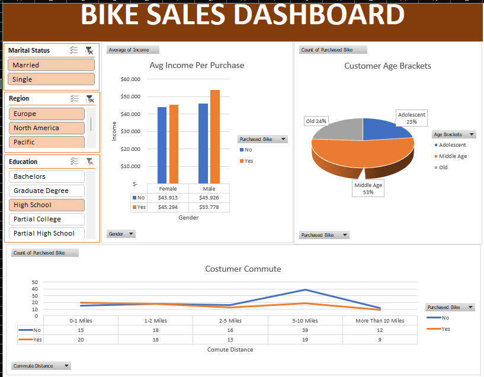

# bike-sales-dashboard-excel
Interactive Bike Sales Dashboard built with Microsoft Excel, focusing on data cleaning, analysis, visualization, and dashboard development.

# Excel_Bike_Sales_Dashboard

In this project, I'm doing **data cleaning, data processing, data analysing, and data visualization using Microsoft Excel** to explore customer demographics and bike purchasing behavior. The goal was to transform raw customer data into an interactive **Bike Sales Dashboard** using PivotTables, charts, and slicers.

This project contains **1,000 customer records** after data preparation, with information including income, gender, marital status, education, occupation, commute distance, region, age, and bike purchase status.

The project was completed as a **guided project based on an Excel tutorial by Alex The Analyst**, with the purpose of practicing and strengthening my skills in Excel data analysis and dashboard development.

## Data Cleaning (Preparation)

The first step was to prepare the raw dataset for analysis.

The steps for data cleaning included:

* Checked and removed duplicate records;
* Standardized values in the **Marital Status** column:

  * `M` → `Married`
  * `S` → `Single`
* Standardized values in the **Gender** column:

  * `M` → `Male`
  * `F` → `Female`
* Formatted income values into a consistent numerical/currency format;
* Reviewed categorical values to ensure consistency before analysis.

## Data Processing

After cleaning the dataset, additional transformations were performed to make the data more suitable for analysis.

* Created a calculated **Age Brackets** column based on customer age;
* Grouped customers into three categories:

  * **Adolescent** — below 31 years
  * **Middle Age** — 31–54 years
  * **Old** — above 54 years
* Standardized the commute distance category **More Than 10 Miles** for clearer visualization and analysis.

The processed dataset was stored in the **Working Sheet** and used as the source for the Pivot Tables.

## Data Analysis

I used **PivotTables** to summarize customer characteristics and identify patterns in bike purchasing behavior.

The main analyses include:

* **Average Income by Gender and Purchased Bike**

  * Compared the average income of male and female customers based on whether they purchased a bike.
* **Commute Distance and Purchased Bike**

  * Analyzed the number of bike purchasers and non-purchasers across different commute distance categories.
* **Age Brackets and Purchased Bike**

  * Compared bike purchasing behavior among Adolescent, Middle Age, and Old customer groups.
* Added interactive **slicers** for customer segmentation and dashboard filtering.

## Data Visualization

The analysis was visualized in an interactive **Bike Sales Dashboard** using Excel charts, PivotTables, and slicers.

The dashboard contains:

* **Average Income by Gender & Purchased Bike** — Bar Chart
* **Customer Commute Distance** — Line Chart
* **Customer Age Brackets** — Pie Chart
* Slicers for filtering customer characteristics such as **Marital Status, Region, and Education**

Take a look at the Excel project **[here](Project.xlsx)**.

.png)

## Insight

Based on the analysis, several patterns can be observed:

* Male customers who purchased a bike have a higher average income than male customers who did not purchase one.
* Female customers who purchased a bike also have a slightly higher average income than female customers who did not purchase one.
* Customers with a **5–10 mile commute** represent the largest group in the dataset, although a larger number of them did not purchase a bike.
* **Middle Age customers** represent the largest age group and account for the highest number of bike purchases.
* The Middle Age group has **59 bike purchasers**, compared with 9 Adolescent and 11 Old customers.
* Customers in the **0–1 mile commute** category show a relatively high proportion of bike purchases compared with other commute groups.

These findings provide an overview of how customer income, age, and commuting distance relate to bike purchasing behavior.

## What I Learned

Through this project, I gained hands-on experience with:

* Data cleaning and preparation using Microsoft Excel;
* Standardizing categorical data;
* Creating calculated columns and age categories;
* Using PivotTables to summarize and explore data;
* Creating Pivot Charts for data visualization;
* Using slicers to build interactive dashboards;
* Presenting analytical findings through visual storytelling;
* Structuring an Excel project as part of a professional Data Analytics portfolio.

This project strengthened my understanding of the workflow from **raw data to an interactive dashboard** and provided practical experience in applying Excel for data analysis.

## Project Reference

This project was completed as a guided project based on a tutorial by **Alex The Analyst**.

The tutorial served as a learning reference for the Excel data cleaning, PivotTable, visualization, and dashboard development process.

## Tools

* Microsoft Excel
* PivotTables
* Pivot Charts
* Slicers
* Excel Formulas

